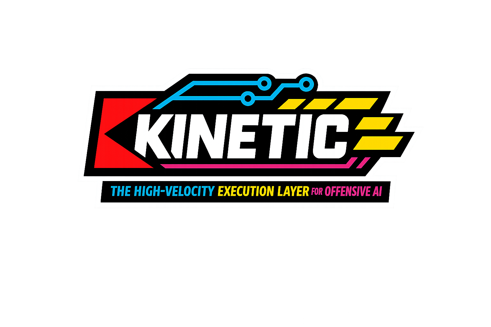

# ⚡ Kinetic (v0.2.5)
### The High-Velocity, Agentic Offensive MCP Gateway



[](https://opensource.org/licenses/MIT)
[](https://www.python.org/)
[](https://www.docker.com/)
[](https://modelcontextprotocol.io)

**WellQ / Kinetic** is a next-generation Model Context Protocol (MCP) gateway designed for professional Red Teams and Vulnerability Researchers. It transforms Claude (or any MCP-compatible LLM) into an autonomous security operator by providing a multi-threaded, dockerized, and "safe-shell" execution environment.

Unlike standard MCP servers, **Kinetic** acts as a tactical middleman—validating intent, parsing complex tool outputs into structured JSON, and providing headless browser eyes for DOM-based exploitation.

---

## 🚀 Key Features

* **⚡ Multi-Threaded Execution:** Powered by a FastAPI-based "Strike Engine" that handles concurrent Nmap, Nuclei, and Ffuf scans without blocking.
* **🛡️ The "Safe-Shell" Validator:** Strict Pydantic-based input validation and YAML-defined tool allowlists to prevent AI command injection.
* **👁️ Visual Intel:** Integrated Selenium sidecar for automated XSS verification, CMS fingerprinting, and page screenshots.
* **🧬 Researcher Arsenal:** Pre-installed with `Semgrep`, `Gitleaks`, `Subfinder`, `Amass`, and `Arjun` for full-spectrum recon and SAST.
* **📦 One-Click Deployment:** Fully dockerized architecture with a dedicated workspace manager for ephemeral git cloning and code auditing.
* **🛑 Emergency Brake:** Global `abort_scan` tool allowing the AI (or human) to instantly terminate rogue processes via SIGKILL.

---

## 🛠️ Architecture

WellQ / Kinetic utilizes a decoupled microservices architecture to ensure host safety and maximum performance:

* **The Gate (MCP Server):** A FastMCP implementation that maps AI intent to the Engine.
* **The Strike Engine (FastAPI):** An asynchronous backend that manages the `TaskRunner` and tool lifecycle.
* **The Vault (Docker):** A hardened Kali-rolling based container containing the offensive binaries.
* **The Eye (Selenium):** A standalone Chrome sidecar for headless DOM interaction.

---

## 📥 Installation & Setup

### 1. Clone the Repository
```bash
git clone [https://github.com/wellq-io/kinetic.git](https://github.com/wellq-io/kinetic.git)
cd kinetic